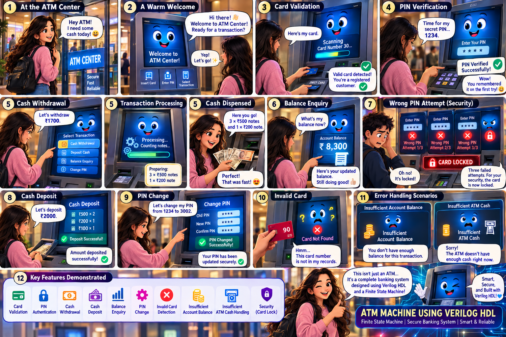
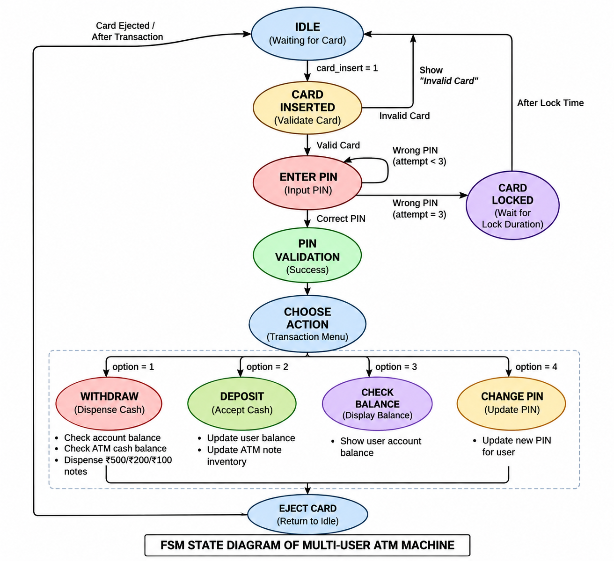
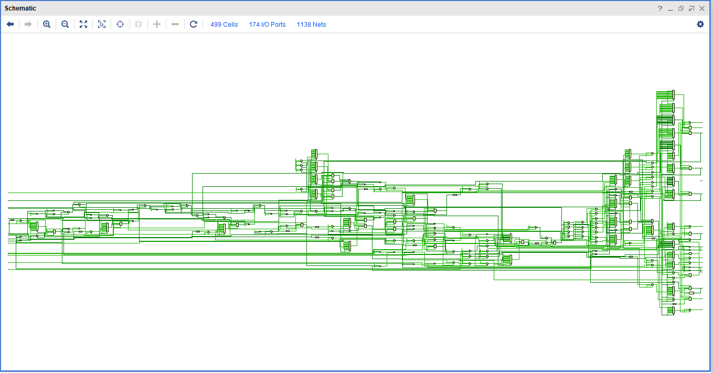
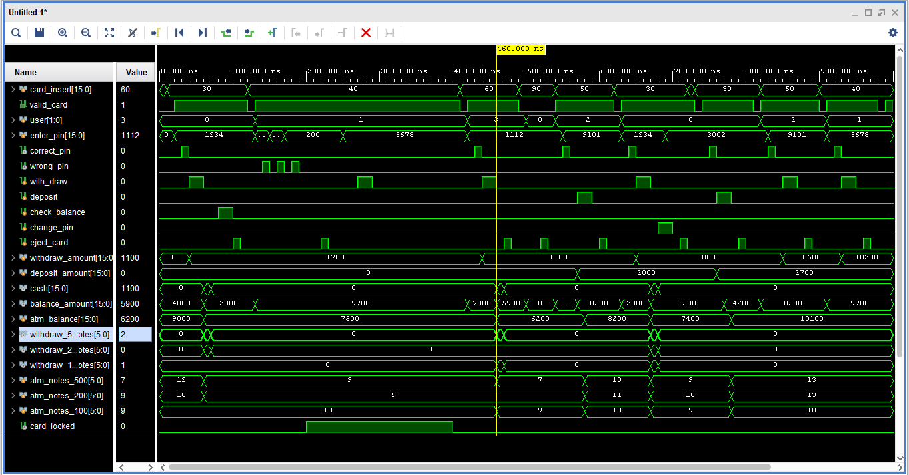

# 💳 Multi-User ATM Machine using Verilog HDL

> **Finite State Machine (FSM) based RTL Design for Secure Multi-User Banking Transactions**

## 🚀 Project Overview

This RTL design models an ATM controller that supports multiple users through individual card numbers, PINs, and account balances while maintaining a shared ATM cash balance and currency note inventory.

The design is implemented using **Verilog HDL** and functionally verified using **Vivado Simulator**.

## ✨ Features

- 💳 Multi-user card authentication
- 🔐 PIN verification with 3-attempt card lock security
- 💰 Cash Withdrawal
- 💵 Cash Deposit
- 📊 Balance Enquiry
- 🔄 PIN Change functionality
- 🏧 ATM cash balance management
- 💸 Currency note distribution (₹500, ₹200, and ₹100 notes)
- ⚙️ FSM-based RTL Design
- ✅ Functional verification using Vivado

## 🏗️ FSM States

The ATM controller consists of **11 FSM states**:

1. IDLE
2. CARD_INSERTED
3. ENTER_PIN
4. PIN_VALIDATION
5. CHOOSE_ACTION
6. WITHDRAW
7. CHECK_BALANCE
8. DEPOSIT
9. CHANGE_PIN
10. CARD_LOCKED
11. EJECT_CARD

## 🛠️ Tools Used

- **Language:** Verilog HDL
- **Simulation:** Vivado Simulator (XSim)
- **RTL Schematic:** Xilinx Vivado

## 📸 Project Preview

The following figures show the overall architecture and verification of the Multi-User ATM Machine.

---

### 🔷 Finite State Machine (FSM)

The FSM controls the complete ATM workflow, from card insertion and PIN verification to transaction processing and card ejection.

---

### 🔷 RTL Schematic (Vivado)

The RTL schematic generated in **Vivado** shows the hardware implementation of the ATM controller and its FSM-based architecture.

---

### 🔷 Functional Simulation (Vivado)

The Vivado simulation waveform verifies the complete functionality of the ATM controller, including authentication, withdrawal, deposit, balance enquiry, PIN change, and card locking.

## 🎯 Learning Outcomes

This project demonstrates the implementation of:

- Finite State Machine (FSM) design.
- Sequential logic in Verilog HDL.
- Multi-user authentication logic.
- ATM transaction processing.
- RTL design and functional verification using Vivado.

## 👥 Team Hanuman

- **Priya Nageswari Karanam**
- **Veera Lakshmi Chennangi**
- **Durga Umesh Arige**
- **Likhitha Paidi**

---
